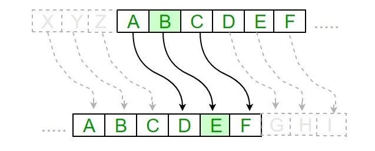
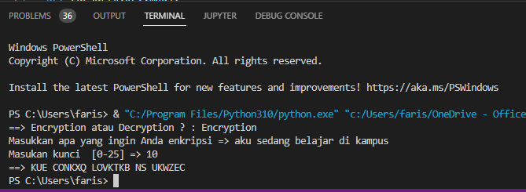

## Kriptografi dengan Python - Caesar Cipher (Encriyption dan Decryption) </p>
<b> Algoritma Caesar Cipher </b> </p>
Algoritma Caesar cipher memiliki fitur-fitur berikut: </p>
<li> Teknik Caesar Cipher adalah metode teknik enkripsi yang sederhana dan mudah. </li> </p>
<li> Ini adalah jenis sandi substitusi sederhana. </li> </p>
<li> Setiap huruf teks biasa diganti dengan huruf dengan beberapa posisi tetap di bawah alfabet. </li> </p>

Diagram berikut, menggambarkan cara kerja implementasi algoritma Caesar cipher. </p>
 </p>

<b> Implementasi program dari algoritma Caesar cipher adalah sebagai berikut: </b> </p>


```python


def transform(x): 
    x = list(x)
    for i,n in enumerate(x):
        if n in ABC:
            x[i] = ABC.index(n)
    return x
def crypt(x,key):
    x = transform(x)
    x = [(n + key)%26 if type(n) == int else n for i,n in enumerate(x)]
    return x

def decrypt(x,key):
    x = transform(x)
    d = []
    if key == None:
        for k in range(26):
            d.append(crypt(x,-k))
        x = d
        return x
    else: 
        return crypt(x,-key)

def caesar(x,key,mod):
    v = []
    if mod:
        x = crypt(x,key)
    else:
        x = decrypt(x,key)
    for i,n in enumerate(x):
        if type(n) == int:
            x[i] = ABC[n]
        elif type(n) == list:
            for j,m in enumerate(n):
                if type(m) == int:
                    n[j] = ABC[m]
            value = ''.join(n)
            #v.append('==> key = {} : {}'.format(i,value)) #for old version
            v.append(f'==> key = {i} : {value}')
    if len(v) != 0:
        return '\n'.join(v)
    #return "==> {}.format(''.join(x))" #for old version
    return f"==> {''.join(x)}"

ABC = list('ABCDEFGHIJKLMNOPQRSTUVWXYZ')
if input('==> Encryption atau Decryption ? : ').lower() == 'encryption':
    x = input('Masukkan apa yang ingin Anda enkripsi => ').upper()
    key = int(input('Masukan kunci  [0-25] => '))
    mod = True
else : 
    x = input('Masukkan apa yang ingin Anda dekripsi=> ').upper()
    if input('Apakah Anda memiliki kuncinya ? (ya/tidak) :').lower() == 'y':
        key = int(input('Masukan Kunci => '))
    else: key=None
    mod = False	
print(caesar(x,key,mod))

```
</p>

<b> Output program </b> </p>
Anda dapat melihat Caesar cipher, yaitu output seperti yang ditunjukkan pada gambar berikut: </p>

 </p>

<b> Penjelasan... </b> </p>
<li> Karakter teks biasa dilalui satu per satu. </li> </p>
<li> Untuk setiap karakter dalam teks biasa yang diberikan, ubah karakter yang diberikan sesuai aturan tergantung pada prosedur enkripsi dan dekripsi teks. </li> </p>
<li> Setelah langkah-langkah tersebut diikuti, string baru dihasilkan yang disebut sebagai teks sandi. </li> </p>

